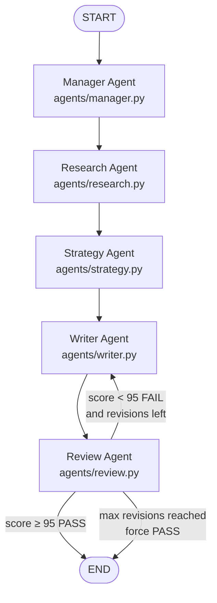
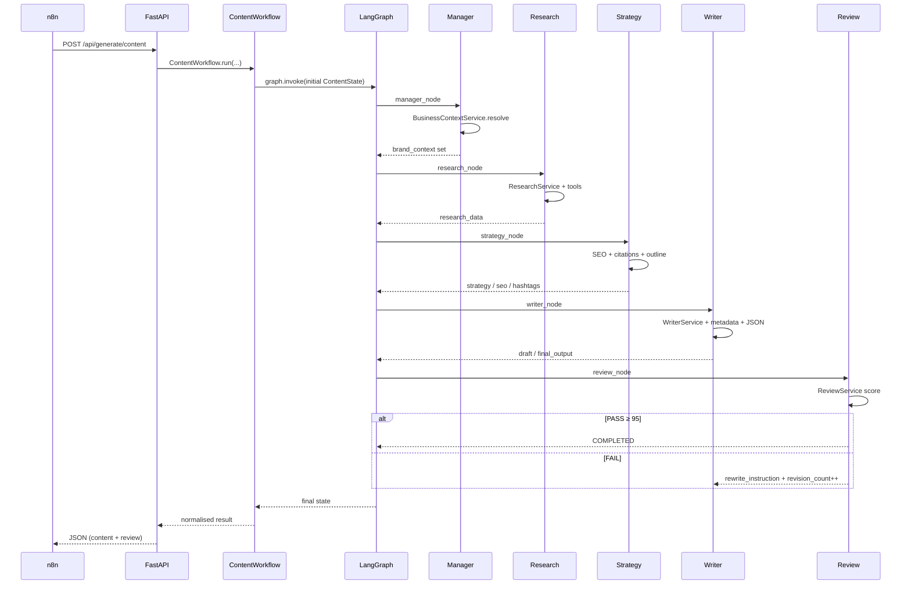

# Technical Walkthrough — SEO Multi-Agent Tool

**Audience:** Engineers integrating, extending, or debugging this system  
**Companion files:** `Readme.md` (quick start) · `Technical.md` (this document) · `Technical.pdf` (export)  
**Last aligned with codebase:** LangGraph 5-agent pipeline · PASS threshold **95** · max revisions **3**

---

## Table of contents

1. [Purpose of this workflow (why we built it)](#1-purpose-of-this-workflow-why-we-built-it)
2. [What this system is](#2-what-this-system-is)
3. [Master end-to-end steps (n8n → agents → approval)](#3-master-end-to-end-steps-n8n--agents--approval)
4. [System architecture](#4-system-architecture)
5. [LangGraph agent pipeline (step by step)](#5-langgraph-agent-pipeline-step-by-step)
6. [Shared state (`schemas/state.py`)](#6-shared-state-schemasstatepy)
7. [Brand loading & business context](#7-brand-loading--business-context)
8. [File-by-file map (what to edit where)](#8-file-by-file-map-what-to-edit-where)
9. [Workflows & API surface](#9-workflows--api-surface)
10. [Review, scoring & rewrite loop](#10-review-scoring--rewrite-loop)
11. [Memory, models & external tools](#11-memory-models--external-tools)
12. [Configuration reference](#12-configuration-reference)
13. [Beginner change cookbook](#13-beginner-change-cookbook)
14. [Implementation status: n8n / Sheets](#14-implementation-status-n8n--sheets)

---

## 1. Purpose of this workflow (why we built it)

### 1.1 What we are *not* optimizing for

This system was **not** built to chase:

- vanity views  
- follower growth  
- “viral” hooks that excite but leave the reader empty  
- SEO spam that ranks without teaching  

Attention without understanding is a failed outcome here.

### 1.2 What we *are* optimizing for

We build content so that a real person facing a real problem can:

1. **Learn something concrete** (not just feel inspired for 10 seconds)  
2. **Move closer to solving a pain point** in their domain  
3. Or — if we cannot fully solve it — get a **clear next path** (what to read, try, or ask) **without being confused**  

In short: **help over hype. Clarity over clicks.**

### 1.3 Problem we are solving (example)

Suppose a user wants to learn **LangGraph** and **persistent memory**.

They search Google or social media and find:

- many popular posts  
- high views / likes  
- catchy titles  

But deep down, those pieces often:

- skim the surface  
- skip the “how it actually works” gaps  
- excite the reader briefly  
- **do not enlighten** them enough to apply the idea  

Our job is to **fill those gaps**.

If someone reads *our* article, blog, email, or social thread, they should leave with either:

- a clearer mental model + useful steps, **or**  
- an honest pointer on **where / how** to get the right depth next — without baffling jargon or dead ends  

That purpose should guide prompts, research, strategy keywords, writing tone, review rubrics, and human approval (“Would this actually help someone stuck on this problem?”).

---

## 2. What this system is

The **SEO Multi-Agent Tool** (app name: *Editorial Intelligence System*) is a **multi-agent content factory**.

Given a **topic** (and optional brand), it:

1. Resolves **which brand** and **which content channel** (article, email, SEO, social)
2. **Researches** the topic (web / news / YouTube; optional brand KB)
3. Builds an **SEO + content strategy** (keywords, outline, citations)
4. **Writes** a full draft in Markdown
5. **Reviews** the draft with a weighted scorecard
6. If the score is below **95**, **rewrites** (up to **3** times) using editor feedback
7. Returns a structured payload (`final_output` + `review` + `metadata`)

Internally this is a **LangGraph** state machine (orchestrator for graphing + routing).  
Externally it is triggered by an **n8n** workflow that reads topics from a **Google Sheet**, calls this backend, updates the sheet, and sends approval emails.

---

## 3. Master end-to-end steps (n8n → agents → approval)

This is the **canonical walkthrough**. Follow it top to bottom.

```
CLOCK (example: every day at 9:00 AM)
   │
   ▼
n8n TRIGGER
   │
   ▼
Google Sheet  →  read row(s) where status = "pending"
   │               (columns: topic, brand, …)
   ▼
n8n HTTP CALL  →  POST /api/generate/content  (LangGraph API / FastAPI)
   │
   ▼
MULTI-AGENT PIPELINE  (LangGraph orchestrator: graphs/graph.py + graphs/routing.py)
   │
   │   Shared memory = schemas/state.py (ContentState)
   │   Every agent READS what it needs from state and WRITES its outputs
   │   into the same state for the next agent’s handoff.
   │
   ├── 1) agents/manager.py
   │       Brand + business intent / category intent
   │       (BusinessContextService + brands.yaml)
   │       → writes brand_context
   │
   ├── 2) agents/research.py
   │       Research package (docs, stats, citations, sources)
   │       → writes research_data, retrieved_documents, sources
   │
   ├── 3) agents/strategy.py   ★ three jobs
   │       a) seo_service.py
   │          - extract keywords: primary / secondary / long_tail (+ industry/technical)
   │          - take Research Agent data
   │          - embed + score / re-rank keywords using:
   │              • frequency signals (TF-IDF + BM25)
   │              • semantic_similarity (embeddings vs query)
   │              • search_intent
   │              • pain_point (vs brand pain points)
   │              • brand_relevance / authority-style fit (vs brand keyword direction)
   │          - output ranked primary/secondary + meta fields
   │       b) hashtags.py (HashtagService)
   │       c) citation.py (CitationService)
   │       → also builds outline; writes strategy, seo, hashtags
   │
   ├── 4) agents/writer.py
   │       Uses strategy blueprint + research
   │       WriterService writes Markdown draft
   │       Then MetadataService + Formatter + JSONBuilder package the result
   │       → writes draft, metadata, formatted_output, final_output
   │
   └── 5) agents/review.py
           ReviewService scores draft (target ≥ 95)
           If score < 95 and retries left → route BACK to writer.py
           (LangGraph routing.py). Inner loop max = 3.
           If score ≥ 95 OR max revisons hit → END pipeline
   │
   ▼
Response returns to n8n
   │
   ▼
Google Sheet UPDATE
   • status = "pending review"
   • content generated column = full generated content (markdown / body)
   • review_score / request_id filled
   │
   ▼
EMAIL ALERT → human approval
   │
   ├── APPROVED
   │      → Sheet status = "posted"
   │      → WHOLE OUTER LOOP STOPS for this row ✔
   │
   └── REJECTED
          → send topic back to recreate content
            (call LangGraph API again; Writer↔Review loop up to 3 again)
          → if still not acceptable after those recreates / retries
            → ALERT DEVELOPER ASAP to investigate and fix
```

### 3.1 Google Sheet (suggested columns)

| Column | Example | Meaning |
|--------|---------|---------|
| `topic` | Startup marketing from scratch | Brief / query |
| `brand` | Futuristix | Optional; auto-detect if blank |
| `content_type` | article | article / blog / email / … |
| `status` | pending | pending → pending review → posted (or rejected) |
| `content_generated` | full markdown | Filled after LangGraph returns |
| `request_id` | uuid | From API |
| `review_score` | 95 | From API `review.score` |
| `retry_count` | 0 | Optional: human-reject recreate attempts |
| `approved_by` | email | Filled on approval |
| `updated_at` | ISO timestamp | Last mutation |

### 3.2 Status machine

```
pending
   │  n8n 9 AM (example) picks row + calls API
   ▼
pending review   (+ content_generated filled)
   │  email to human
   ├────────────── APPROVE ──────────────► posted  → STOP
   │
   └────────────── REJECT ───────────────► recreate content via API
                                              │
                                              ├─ review/writer loop ≤ 3 inside LangGraph
                                              ├─ optional outer recreate ≤ 3
                                              └─ still bad → ALERT DEVELOPER
```

### 3.3 n8n checklist (for implementers)

1. **Trigger:** Cron (example `0 9 * * *` = 9:00 AM) or Manual  
2. **Sheets → Read** rows where `status = pending`  
3. **HTTP Request** → `POST /api/generate/content` (timeout 10–15 min)  
4. **Sheets → Update** `content_generated`, `review_score`, `request_id`, `status = pending review`  
5. **Email** approver with preview + Approve / Reject  
6. **On Approve:** `status = posted` → stop  
7. **On Reject:** call API again to recreate; increment `retry_count`; after limit → Slack/email **developer alert**

### 3.4 Which API to call from n8n

| Sheet intent | HTTP call |
|--------------|-----------|
| Long-form article/blog | `POST /api/generate/content` |
| Email campaign | `POST /api/generate/email` |
| SEO package | `POST /api/generate/seo` |
| Social post | `POST /api/generate/social` |
| Let the system decide | `POST /api/generate` |

Example body:

```json
{
  "user_input": "How to start startup digital marketing from scratch",
  "content_type": "article",
  "brand": "Futuristix",
  "objective": "seo",
  "language": "English",
  "max_revisions": 3
}
```

**Important:** Generation can take several minutes. Configure the n8n HTTP node timeout accordingly (e.g. 10–15 minutes).

---

## 4. System architecture

### 4.1 High-level layers

```
┌─────────────────────────────────────────────────────────────────┐
│  TRIGGER LAYER                                                  │
│  n8n  ·  Google Sheets  ·  Email approval  ·  Streamlit (dev UI)│
└───────────────────────────────┬─────────────────────────────────┘
                                │ HTTP
┌───────────────────────────────▼─────────────────────────────────┐
│  API LAYER — api/app.py (FastAPI)                               │
│  /api/generate/*  →  Workflow classes                           │
└───────────────────────────────┬─────────────────────────────────┘
                                │
┌───────────────────────────────▼─────────────────────────────────┐
│  WORKFLOW LAYER — workflows/*.py                                │
│  Builds ContentState → invokes compiled LangGraph               │
└───────────────────────────────┬─────────────────────────────────┘
                                │
┌───────────────────────────────▼─────────────────────────────────┐
│  GRAPH LAYER — graphs/graph.py + graphs/routing.py              │
│  Manager → Research → Strategy → Writer → Review ↺ Writer       │
└───────────────────────────────┬─────────────────────────────────┘
                                │
┌───────────────────────────────▼─────────────────────────────────┐
│  AGENT NODES — agents/*.py                                      │
│  Thin orchestrators; business logic lives in services/          │
└───────────────────────────────┬─────────────────────────────────┘
                                │
┌───────────────────────────────▼─────────────────────────────────┐
│  SERVICES / TOOLS / MODELS                                      │
│  Research tools · SEO · Writer · Review · Brand YAML · LLMs     │
└─────────────────────────────────────────────────────────────────┘
```

### 4.2 True agent sequence (read this carefully)

> Beginner note: the pipeline is **not** Manager → Strategy.  
> Manager always hands off to **Research**. Strategy comes **after** research.



### 4.3 Sequence (happy path)



---

## 5. LangGraph agent pipeline (step by step)

Graph wiring lives in `graphs/graph.py`.  
Conditional routing lives in `graphs/routing.py`.

### Step 0 — Workflow builds the initial state

**Files:** `workflows/content_workflow.py` (and email / seo / social siblings)

Before any agent runs:

1. Validate `user_input`, `content_type`, `objective`
2. Create `request_id` / `session_id`
3. Optionally prefix user input with `[Brand: Futuristix]`
4. Build a full `ContentState` dict (`_build_state`)
5. Call `graph.invoke(initial_state)` — the graph is **already compiled** at import time in `graphs/graph.py`

Initial fields of note:

| Field | Initial value |
|-------|---------------|
| `workflow_status` | `"INIT"` |
| `next_agent` | `"manager"` |
| `revision_count` | `0` |
| `max_revision_count` | `3` (settings / request) |
| `brand_context`, `research_data`, `strategy`, `draft`, `review`, … | empty defaults |

---

### Step 1 — Manager Agent (`agents/manager.py`)

**Job:** Validate input and resolve **business context** (brand + channel intent).  
**Does not** call an LLM.

```
user_input + optional brand
        │
        ▼
BusinessContextService.resolve()
        │
        ├── match brand (explicit UI/API brand, then aliases in text, else Futuristix)
        ├── detect workflow intent (content / email / seo / social keywords)
        └── flatten brand YAML fields into brand_context
        │
        ▼
ContentState["brand_context"] = { tone, cta, pain_points, namespace, workflow, … }
workflow_status = RUNNING
next_agent = research
```

**State written**

| Field | Value |
|-------|--------|
| `brand_context` | Flattened brand + workflow detection result |
| `workflow_status` | `"RUNNING"` |
| `current_agent` | `"manager"` |
| `next_agent` | `"research"` |

**Handoff:** Manager → **Research** (edge in `graphs/graph.py`).

---

### Step 2 — Research Agent (`agents/research.py`)

**Job:** Collect evidence for the writer.  
**Service:** `services/research_service.py`  
**Tools:** `tools/tavily_search.py`, `tools/news_search.py`, `tools/youtube_search.py`

Produces a research package:

```json
{
  "documents": [ … ],
  "total_documents": 11,
  "sources": [ … ],
  "statistics": [ "… 42% … (Source: Title)", … ],
  "citations": [ "Title - Author (date) - url", … ]
}
```

**State written**

| Field | Value |
|-------|--------|
| `research_data` | Full package |
| `retrieved_documents` | Flat document list |
| `sources` | Source list |
| `next_agent` | `"strategy"` |

**Handoff:** Research → **Strategy**.

---

### Step 3 — Strategy Agent (`agents/strategy.py`)

**Job:** Turn research into a **blueprint** the writer must follow.  
**LangGraph handoff:** Research → Strategy → Writer.

Strategy has **three dedicated service jobs** (plus outline assembly):

#### 3a) `services/seo_service.py` (keyword scoring + re-rank)

1. Merge Research Agent documents into a corpus  
2. Extract candidate keywords via LLM into buckets:  
   **primary** / **secondary** / **long_tail** (+ industry / technical)  
3. Score each keyword against research + brand using embeddings and classical IR:  

| Signal (code name) | Plain meaning | Weight |
|--------------------|---------------|--------|
| `semantic_similarity` | How close the keyword is to the user topic (embeddings) | 40% |
| `tfidf` | Frequency / importance in the research corpus | 20% |
| `bm25` | Ranking relevance vs research docs (frequency-aware) | 15% |
| `pain_point` | Fit to brand pain points | 10% |
| `search_intent` | Informational / commercial / … | 10% |
| `brand_relevance` | Fit to brand keyword direction (authority-style brand fit) | 5% |

4. Compute weighted final score → **re-rank** keywords descending  
5. Emit SEO blueprint: `primary_keywords`, `secondary_keywords`, `keyword_scores`, intent, meta title/description, slug  

#### 3b) `services/hashtags.py` (HashtagService)

Platform-aware hashtag list → written to `state["hashtags"]`.

#### 3c) `services/citation.py` (CitationService)

Normalises research sources into citation objects → stored on `strategy["citations"]`.

Then Strategy builds / attaches the **outline** and assembles the full `strategy` dict (title, angle, tone, audience, CTA, keywords, outline sections).

**State written**

| Field | Value |
|-------|--------|
| `strategy` | Full writing blueprint |
| `seo` | SEO blueprint from SEOService |
| `hashtags` | Hashtag list |
| `next_agent` | `"writer"` |

**Handoff:** Strategy → **Writer**.

---

### Step 4 — Writer Agent (`agents/writer.py`)

**Job:** Produce publication-ready Markdown and package it for API / n8n / Sheet.

Inside the node:

```
WriterService.run(...)           ← uses strategy blueprint + research_data from state
   ├── first draft OR surgical revise (if rewrite_instruction present)
   └── optional factual enrichment from research stats
MetadataService.run(...)
Formatter.run(...)               ← structures sections / density helpers
JSONBuilder.run(...)             ← builds final_output for API / Sheet column
```

**State written**

| Field | Value |
|-------|--------|
| `draft` | Markdown string |
| `metadata` | word_count, slug, meta_title, read_time_min, … |
| `formatted_output` | Structured sections |
| `final_output` | `{ content, metadata, seo, hashtags, citations }` — this is what n8n copies into **content_generated** |
| `next_agent` | `"review"` |

**Handoff:** Writer → **Review**.

---

### Step 5 — Review Agent (`agents/review.py`)

**Job:** Score draft; enforce quality target **95**; loop Writer if needed.

```
ReviewService.run(...)
   ├── pre-checks (length, keywords, …)
   └── LLM scorecard → weighted overall score

IF score >= 95:
    PASS → workflow COMPLETED → LangGraph END
ELIF revision_count < max (3):
    write rewrite_instruction into strategy
    revision_count += 1
    routing.py → back to writer.py   ← INNER LOOP
ELSE:
    force PASS with current score + feedback note
    END  (n8n still puts content in Sheet for human review)
```

Router: `graphs/routing.py` (`review_router`) only checks `needs_revision`.

---

## 6. Shared state (`schemas/state.py`)

Every agent reads the same `ContentState` TypedDict.  
**Rule:** an agent should only write the fields it owns.

| Owner | Fields |
|-------|--------|
| Workflow entry | `request_id`, `session_id`, `user_input`, `brand`, `content_type`, `platform`, `objective`, `language`, `additional_instructions`, `revision_count`, `max_revision_count` |
| Manager | `brand_context`, `workflow_status` (INIT→RUNNING), `current_agent`, `next_agent` |
| Research | `research_data`, `retrieved_documents`, `sources` |
| Strategy | `strategy`, `seo`, `hashtags` |
| Writer | `draft`, `metadata`, `formatted_output`, `final_output` |
| Review | `review`, `revision_count` (on FAIL), `strategy.rewrite_instruction`, `workflow_status` → COMPLETED |
| Any | `errors` |

Supporting Pydantic contracts (validate shapes before storing):

- `schemas/research_schema.py`
- `schemas/strategy_schema.py`
- `schemas/review_schema.py`

---

## 7. Brand loading & business context

There are **two** readers of `brands/brands.yaml`. They do different jobs.

```
brands/brands.yaml
        │
        ├── BrandLoader                 → GET /api/brands only (list UI)
        │   brands/brand_loader.py
        │
        └── BusinessContextService      → Manager + POST /api/generate routing
            services/business_context_service.py
```

### 7.1 `BrandLoader` (`brands/brand_loader.py`)

- `_load()` → reads YAML → `data["brands"]`
- `get_all_brands()` / `get_brand(name)` / `brand_exists(name)`
- **No** business logic, **no** ContentState writes

### 7.2 `BusinessContextService` (`services/business_context_service.py`)

| Method | Purpose |
|--------|---------|
| `_detect_workflow(user_input)` | Keyword-based **category / channel intent** (content, email, seo, social) |
| `_build_context(cfg, user_input)` | Flattens YAML brand fields + workflow fields |
| `resolve(user_input, brand)` | Explicit brand → alias match → default Futuristix |

Return shape (stored as `ContentState["brand_context"]`):

```python
{
  # flattened from brands.yaml
  "display_name": "Futuristix / Agentic AI",
  "namespace": "futuristix",
  "tone": "Practical, ROI-driven",
  "cta": "Book an AI Discovery Call",
  "reader_segment": [...],
  "pain_points": [...],
  "keyword_direction": [...],
  "aliases": [...],
  "brand_config": { ... raw YAML object ... },

  # from _detect_workflow
  "workflow": "content",          # content | email | seo | social
  "content_type": "article",
  "platform": None,
  "campaign_type": None,
  "objective": "seo",
}
```

> Why flattening matters: Writer and Review read `brand_context["tone"]` / `["cta"]` at the **top level**.  
> Nested-only `brand_config` would leave brand alignment / CTA scoring blind.

### 7.3 Brands in YAML today

| Key | Display | Example CTA |
|-----|---------|-------------|
| `gtib` | GTIB / M&A Advisory | Schedule an Advisory Call |
| `kinvo` | Kinvo Care | Book a Consultation |
| `mpm` | MPM | Contact Property Advisor |
| `futuristix` | Futuristix / Agentic AI | Book an AI Discovery Call |
| `gcb` | GCB | Contact Our Engineering Team |

**Where to change a brand voice:** edit `brands/brands.yaml` only — restart API to reload (loader reads file at process start).

---

## 8. File-by-file map (what to edit where)

### Entry & API

| File | Responsibility |
|------|----------------|
| `main.py` | Starts uvicorn → `api.app:app` |
| `api/app.py` | FastAPI app, CORS, `/api/health`, `/api/brands`, mounts routers |
| `api/schemas.py` | Request/response models (`ContentRequest`, …) |
| `api/routes/content.py` | Calls `ContentWorkflow` |
| `api/routes/email.py` | Calls `EmailWorkflow` |
| `api/routes/seo.py` | Calls `SEOWorkflow` |
| `api/routes/social.py` | Calls `SocialWorkflow` |
| `api/routes/generate.py` | Auto-route using `BusinessContextService` |
| `frontend/app.py` | Streamlit UI for local testing |

### Graph & agents

| File | Responsibility |
|------|----------------|
| `graphs/graph.py` | Registers nodes & edges; compiles graph |
| `graphs/routing.py` | Review → Writer or END |
| `agents/manager.py` | Brand + intent → `brand_context` |
| `agents/research.py` | Fills research fields |
| `agents/strategy.py` | Fills strategy / seo / hashtags |
| `agents/writer.py` | Fills draft / metadata / final_output |
| `agents/review.py` | Fills review; enforces revision cap |

### Workflows

| File | Responsibility |
|------|----------------|
| `workflows/content_workflow.py` | Article/blog defaults + invoke graph |
| `workflows/seo_workflow.py` | SEO objective + `seo_analysis` post-process |
| `workflows/email_workflow.py` | Email defaults + `email_meta` |
| `workflows/social_workflow.py` | Platform mapping + `social_meta` |

### Core services (business logic)

| File | Responsibility |
|------|----------------|
| `services/business_context_service.py` | Brand resolve + workflow intent |
| `services/research_service.py` | Multi-source research merge |
| `services/seo_service.py` | Keyword pipeline (TF-IDF, BM25, embeddings, LLM) |
| `services/citation.py` | Citation normalisation |
| `services/hashtags.py` | Hashtag generation |
| `services/writer_service.py` | Draft / revise / factual enrichment |
| `services/review_service.py` | Scorecard + rewrite instructions (`PASS_THRESHOLD=95`) |
| `services/metadata_service.py` | Word count, slug, meta fields |
| `services/formatter.py` | Section structure / density |
| `services/json_builder.py` | Final response assembly |

### Tools, models, memory, config

| File | Responsibility |
|------|----------------|
| `tools/tavily_search.py` | Web research |
| `tools/news_search.py` | NewsAPI |
| `tools/youtube_search.py` | YouTube + transcripts |
| `tools/reddit_search.py` | Present but not wired into ResearchService |
| `models/llm.py` | Anthropic Claude client |
| `models/embeddings.py` | OpenAI embeddings |
| `memory/conversation_memory.py` | Optional session memory after runs |
| `memory/mongodb.py` | Mongo repositories |
| `memory/vector.py` | Pinecone vector store (KB; may be optional) |
| `config/settings.py` | All `.env` settings |
| `prompts/*.md` | Human-readable agent contracts |
| `validators/*` | Shape validators (available; not all wired into nodes) |

---

## 9. Workflows & API surface

### HTTP endpoints

| Method | Path | Backend |
|--------|------|---------|
| GET | `/api/health` | Health |
| GET | `/api/brands` | `BrandLoader` |
| POST | `/api/generate` | Auto workflow |
| POST | `/api/generate/content` | `ContentWorkflow` |
| POST | `/api/generate/email` | `EmailWorkflow` |
| POST | `/api/generate/seo` | `SEOWorkflow` |
| POST | `/api/generate/social` | `SocialWorkflow` |

Swagger UI: `http://localhost:8000/docs`

### Important: all four workflows share one graph

Email / SEO / Social are **wrappers** around the same Manager→Research→Strategy→Writer→Review graph. They change defaults and post-process metadata (`email_meta`, `seo_analysis`, `social_meta`).

---

## 10. Review, scoring & rewrite loop

### Weighted dimensions (`services/review_service.py`)

| Dimension | Weight |
|-----------|--------|
| content_quality | 20% |
| seo_compliance | 25% |
| brand_alignment | 20% |
| structure | 15% |
| factual_grounding | 15% |
| cta_effectiveness | 5% |

- **PASS** if weighted score ≥ **95**
- **Max rewrite cycles:** **3** (`MAX_REVIEW_ITERATIONS` / request `max_revisions`)

### Rewrite behaviour

On FAIL (with budget remaining):

1. Review writes `strategy["rewrite_instruction"]`
2. Router sends state back to Writer
3. Writer calls `_revise_long_form(previous_draft=...)` — **surgical edit**, not a blind regenerate
4. Optional `_enrich_factual_grounding` injects attributed research stats

**Purpose check during review/approval:** Prefer content that teaches and reduces confusion over content that only “sounds viral.”

---

## 11. Memory, models & external tools

| Concern | Provider | Required? |
|---------|----------|-----------|
| Writing + review | Anthropic Claude | Yes for generation |
| Embeddings / SEO scoring | OpenAI | Yes |
| Web research | Tavily | Strongly recommended |
| News | NewsAPI | Optional |
| Video | YouTube Data API | Optional |
| Brand KB | Pinecone | Optional |
| Session persistence | MongoDB | Optional |

LangSmith tracing can be enabled via `LANGCHAIN_*` env vars.

---

## 12. Configuration reference

See `config/settings.py` and `.env`.

| Setting | Default | Meaning |
|---------|---------|---------|
| `MAX_REVIEW_ITERATIONS` | 3 | Rewrite cap |
| `PASS_THRESHOLD` | 95 | In `review_service.py` (not env) |
| `MIN_ARTICLE_WORDS` / `MAX_ARTICLE_WORDS` | 1200 / 2500 | Length guards |
| `ANTHROPIC_MODEL` | `claude-sonnet-4-6` | Generation model |
| `OPENAI_EMBEDDING_MODEL` | `text-embedding-3-small` | Embeddings |
| `ENVIRONMENT` | `development` | Enables uvicorn reload |

---

## 13. Beginner change cookbook

| I want to… | Edit this |
|------------|-----------|
| Change brand tone / CTA / audience | `brands/brands.yaml` |
| Change PASS score from 95 | `services/review_service.py` → `PASS_THRESHOLD` (+ keep `schemas/review_schema.py` / validators in sync) |
| Change max revisions default | `config/settings.py` → `MAX_REVIEW_ITERATIONS` (+ API/UI defaults if needed) |
| Improve first-draft writing rules | `services/writer_service.py` prompts |
| Improve rewrite behaviour | `WriterService._revise_long_form` / `_enrich_factual_grounding` |
| Improve research sources | `services/research_service.py` + `tools/*` |
| Improve keyword ranking | `services/seo_service.py` |
| Change graph order / add an agent | `graphs/graph.py` + new `agents/*.py` |
| Change API request fields | `api/schemas.py` + matching route |
| Change Streamlit UI | `frontend/app.py` |
| Wire n8n | Call existing REST endpoints; update Google Sheet status outside this repo |

**Restart tip:** After changing Python modules, restart `python main.py` (and Streamlit) so workers load new code.

---

## 14. Implementation status: n8n / Sheets

| Capability | Status |
|------------|--------|
| LangGraph content pipeline | **Implemented** |
| FastAPI + Streamlit | **Implemented** |
| Brand YAML + business context | **Implemented** |
| n8n workflow | **External** — design documented here; not shipped as code in this repo |
| Google Sheets read/write | **External** — owned by n8n Google Sheets nodes |
| Email approval | **External** — owned by n8n (Gmail / Outlook / webhook) |

Recommended ownership split:

- **This repo:** generate perfect content + review scores via HTTP  
- **n8n:** pick pending rows, call API, flip statuses, send mail, wait for approval, mark posted

---

## Appendix A — Quick mental model

```
9 AM n8n
  → Sheet status=pending (topic)
  → POST LangGraph API
  → Manager → Research → Strategy(SEO+Hashtags+Citations) → Writer(Formatter+JSON) → Review
       ↺ Writer if score < 95 (max 3), target 95
  → Sheet: content_generated + status=pending review
  → Email human
       → Approve → posted → STOP
       → Reject  → recreate (≤3) → else ALERT DEVELOPER
```

## Appendix B — Local run (for engineers)

```bash
.\venv\Scripts\Activate.ps1
python main.py                          # API :8000
streamlit run frontend/app.py           # UI  :8501
```

Health check: `GET http://localhost:8000/api/health`

---

*Document maintained for engineers joining the Editorial Intelligence System. Keep this walkthrough in sync when graph edges, PASS threshold, or brand context shapes change.*
